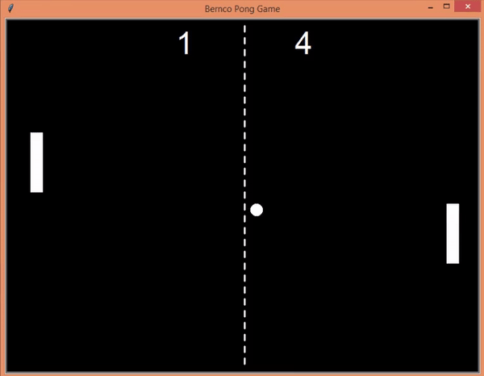

# pong-game
pong game with turtle graphics. Class inheritance and manipulation

<b /> Consists of two players

<b /> First player control is with the arrow keys of the keyboard

<b /> Second players control is with the q and z key to move up and down respectively

<b /> A player wins a point when the other fails to bounce back the ball

